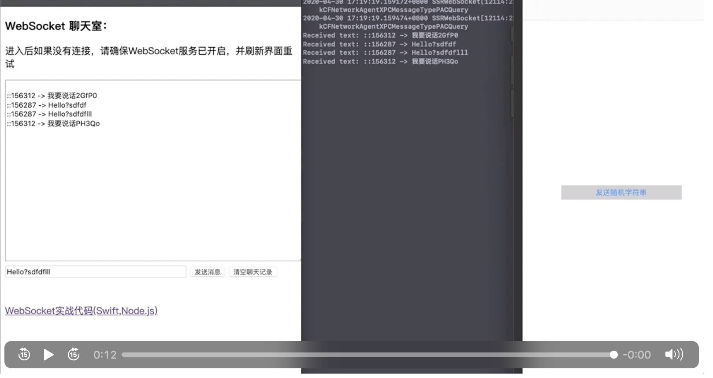

## WebSocket实战:实现APP和网页通信

环境配置
- Swift ： Starscream
- Server:  Node.js



## 启动

1. `npm install ws`
   
2. `node websocket.js` 开启WebSocket服务

3. 运行APP(Run会自动打开一个client.html)就可以聊天了

## 概念
 WebSocket是基于TCP的协议的，全双工通信技术，可以实现服务端和客户端互相通信。
 特点: 

 1. 基于TCP协议
 2. 与HTTP协议有良好的兼容性,默认端口也是80(ws:)和443(wss:), 并且握手阶段采用HTTP协议, 因为握手时不容易比屏蔽，能通过各种HTTP代理服务器。
 3. 数据格式比较轻量，性能开销小，通信高效
 4. 可以发送文本，也可以发送二进制文件, 
 5. 双方都可主动关闭链接

#### WebSocket的局限性

 1. `WebSocket`实现可伸缩性更难
      在HTTP的通信系统中，通过负载均衡做伸缩。而WebSocket只进行一次HTTP连接
 2. `WebSocket`长连接的心跳保持比较复杂
    `WebSocket`长连接是基于`Ping/Pong`的心跳机制来维持。

#### WebSocket的通信过程

1. 首先由客户端发起HTTP请求，在请求头Heade里面增加一个`Upgrade:websocket`字段，表示要升级协议到WebSocket。

	客户端请求报文及实现
	客户端请求报文:
	```text
	GET / HTTP/1.1
	Upgrade: websocket
	Connection: Upgrade
	Host: example.com
	Origin: http://example.com
	Sec-WebSocket-Key: sN9cRrP/n9NdMgdcy2VJFQ==
	Sec-WebSocket-Version: 13
	```
	与传统报文不同的地方:
	```text
	Upgrade: websocket
	Connection: Upgrade
	```
	下面两行表示webscoket协议的信息
	```text
	Sec-WebSocket-Key: sN9cRrP/n9NdMgdcy2VJFQ==   // 随机生成
	Sec-WebSocket-Version: 13
	```

2. 服务端在收到后就会响应一个握手的确认, 发送`status : 101 switching Protocols`表示允许客户端用WebSocket协议。

	服务端响应报文
	```
	HTTP/1.1 101 Switching Protocols
	Upgrade: websocket
	Connection: Upgrade
	Sec-WebSocket-Accept: HSmrc0sMlYUkAGmm5OPpG2HaGWk=
	Sec-WebSocket-Protocol: chat
	```

3. 至此双端就可以互相发送消息了。

   > WebSocket只需要一次HTTP握手

## 常见问题?

1. Socket死链
   
   Socket死链是指Socket链接过程中，一方关闭后，另外一方一直等待的过程中，会造成资源的浪费。
   
   通过心跳机制来处理，即固定时间内由客户端像服务端发送心跳命令，让服务端知道该客户端还存活。

2. `WebSocket`的`Ping` 和 `Pong`的含义？

   长连机制，`Ping`由客户端告诉服务端自己还存活，`Pong`由服务端告诉客户端自己存活

## Reference

 Swift版本的WebSocket框架[Starscream](https://github.com/daltoniam/Starscream)

 [Node.js实现WebSocket聊天室的例子](https://waylau.com/node.js-websocket-chat/)
